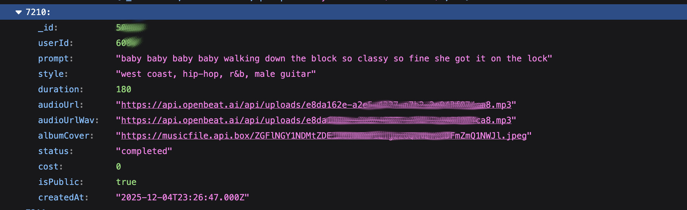

# openbeat.ai

openbeat.ai is an AI based music-generation platform. It offers its services connected with a one-time payment (~50$ when I joined). I was one of the early adopters. A few days later it has been identified as a scam. It was marketed as 'ethically trained' when in reality it was nothing more than a proxy for suno. 

[](https://www.youtube.com/watch?v=Kx0Gg2fkeII)


Worse: Once logged in they allowed for download of data from every user: (songs, prompts, user-id) via a public API. The screenshot below shows an excerpt of the ~12MB json.file that I was able to retrieve last year. It contains roughly 23000 datasets. I was also able to download all tracks from every user created so far. To be fair: on all of the publically available tracks the 'isPublic' value is set to 'true'. However, I think that prompts and especcially user-ids are a little tacky to handle. (Btw: openbeat.ai allows for download of your tracks as wav and/ or mp3. Have a closer look at audioUrl and audioUrlWav.)
  

  
This fortunately seems to have been deactivated around December 2025.  
Nevertheless, I let AI do some poking and thought it's an okay thing to list their publically available endpoints.  
I'll probably share other findings here, as well.  
  

  
## OpenBeat.ai API Endpoints
This is a list of publicly available API  endpoints.
Base URL: `https://openbeat.ai`

| Endpoint | Method | Auth Required | Purpose |
|---|---|---|---|
| `/api/auth/login` | POST | No | Login |
| `/api/auth/register` | POST | No | Register new account |
| `/api/auth/profile` | GET | Yes | Get user profile |
| `/api/auth/sendOtp` | POST | No | Send OTP |
| `/api/auth/forgot-password/send-otp` | POST | No | Password reset - send OTP |
| `/api/auth/forgot-password/verify-otp` | POST | No | Password reset - verify OTP |
| `/api/auth/forgot-password/reset` | POST | No | Password reset - set new password |
| `/api/tracks/my-tracks` | GET | Yes | Get current user's tracks |
| `/api/tracks/public` | GET | Yes | Get public tracks |
| `/api/tracks/stream/:id` | GET | Yes | Stream track audio |
| `/api/audio-to-midi/start` | POST | Yes | Convert audio to MIDI |
| `/api/bpm/extract` | POST | Yes | Extract BPM from audio |
| `/api/stems/extract` | POST | Yes | Stem separation |
| `/api/stems/download/:jobId` | GET | Yes | Download stems (add `?format=wav` for WAV) |
| `/api/admin/login` | POST | No | Admin login |
| `/api/admin` | GET | Yes | Admin panel data |
  
Most of the API endpoints only work when you are logged in to your account. Which is sensible. This API  endpoint was the one that provided all users's data but it has been disabled.  

```
/api/tracks/public  
```

  
The authentication is done using a Bearer token.    
If  you want to get the data for all your tracks run the following command:
  
```
TOKEN="getyourowntokenbycreatinganaccountandderivingitfromchromesnetworktoolsoranyotherwayaskaihowtodoit"
curl -s "https://api.openbeat.ai/api/tracks/my-tracks" -H "Authorization: Bearer $TOKEN"
```
  
Since the the app is running in Vite dev mode the raw source files are directly accessible and the endpoints can be derived from those files:  

```
curl -s "https://openbeat.ai/src/main.jsx" | head -c 500   

curl -s "https://openbeat.ai/src/main.jsx" | grep -oE "from ['\"][^'\"]+['\"]" | grep -v node_modules | head -30  
  
curl -s "https://openbeat.ai/src/App.jsx" | grep -oE "from ['\"][^'\"]+['\"]" | grep -v node_modules | sed "s/from ['\"]//;s/['\"]$//" | sort -u  
  
files=(
  "/src/contexts/AuthContext.jsx"
  "/src/contexts/AdminAuthContext.jsx"
  "/src/contexts/StemsContext.jsx"
  "/src/components/FixedPlayer.jsx"
  "/src/pages/AITraining.jsx"
  "/src/pages/DAWPage.jsx"
  "/src/pages/Generate.jsx"
  "/src/pages/Home.jsx"
  "/src/pages/Library.jsx"
  "/src/pages/Login.jsx"
  "/src/pages/Membership.jsx"
  "/src/pages/Profile.jsx"
  "/src/pages/Register.jsx"
  "/src/pages/admin/AdminDashboard.jsx"
  "/src/pages/admin/AdminUsers.jsx"
  "/src/pages/admin/ManageMusic.jsx"
  "/src/pages/admin/AdminProfile.jsx"
)

for f in "${files[@]}"; do
  curl -s "https://openbeat.ai$f"
done | grep -oE "(/api/[a-zA-Z0-9/_\$\{}-]+|`/api/[^'\"` ]+)" | sort -u
```